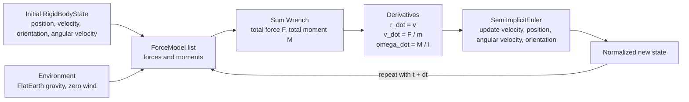

# propagator

Deterministic state propagation and environment modeling for physical systems.

`propagator` is a compact Rust flight-dynamics core for propagating a rigid-body rocket state through time. It is framed for 6-DOF trajectory propagation work like Propulse NTNU's Penumbra simulator: initialize position, velocity, attitude, and angular velocity; evaluate forces and moments against an environment; integrate forward deterministically; repeat.

The current code is intentionally small. It provides the propagation loop, rigid-body state, frame transforms, a flat-earth environment, a gravity force model, and a semi-implicit Euler integrator. Atmosphere, aerodynamic drag, wind perturbations, thrust, staging, and full coupled rotational dynamics are roadmap items rather than implemented features.

## Architecture



### Modules

| Module | Role |
| --- | --- |
| `state` | Defines `RigidBodyState { pos, vel, orient, ang_vel }`. |
| `env` | Defines the `Environment` trait and `FlatEarth` implementation. |
| `forces` | Defines `Wrench`, `ForceModel`, and the built-in `Gravity` force. |
| `integrator` | Defines the `Integrator` trait and `SemiImplicitEuler`. |
| `sim` | Owns the simulation state, sums force models, computes derivatives, and steps the integrator. |
| `frame` | Provides `body_to_world` and `world_to_body` quaternion frame transforms. |

## Math

### State

The propagated state is

$$
x = \left(\mathbf r,\ \mathbf v,\ q,\ \boldsymbol\omega\right)
$$

where:

- $$\mathbf r \in \mathbb R^3$$ is world-frame position.
- $$\mathbf v \in \mathbb R^3$$ is world-frame velocity.
- $$q$$ is a unit quaternion used by `body_to_world(v_body, q) = q v_body`.
- $$\boldsymbol\omega \in \mathbb R^3$$ is angular velocity, used directly by the orientation update.

The simulator computes a total wrench from registered force models:

$$
W = \left(\mathbf F,\ \mathbf M\right)
$$

and converts it to derivatives using scalar mass $$m$$ and diagonal inertia $$\mathbf I = (I_x, I_y, I_z)$$:

$$
\dot{\mathbf r} = \mathbf v
$$

$$
\dot{\mathbf v} = \frac{\mathbf F}{m}
$$

$$
\dot{\boldsymbol\omega} =
\left(\frac{M_x}{I_x},\ \frac{M_y}{I_y},\ \frac{M_z}{I_z}\right)
$$

The current implementation does not include gyroscopic coupling terms such as $$\boldsymbol\omega \times (\mathbf I\boldsymbol\omega)$$.

### Integrator

`SemiImplicitEuler` advances one fixed step $$\Delta t$$. Translational velocity is updated before position:

$$
\mathbf v_{n+1} = \mathbf v_n + \dot{\mathbf v}_n \Delta t
$$

$$
\mathbf r_{n+1} = \mathbf r_n + \mathbf v_{n+1} \Delta t
$$

Angular velocity is updated similarly:

$$
\boldsymbol\omega_{n+1} =
\boldsymbol\omega_n + \dot{\boldsymbol\omega}_n \Delta t
$$

Orientation is advanced with an incremental quaternion from the scaled axis $$\boldsymbol\omega_{n+1}\Delta t$$:

$$
q_{n+1} =
\operatorname{normalize}\left(
q_n \otimes \operatorname{QuatFromScaledAxis}(\boldsymbol\omega_{n+1}\Delta t)
\right)
$$

`Sim::step` normalizes the quaternion again after integration.

### Environment and forces

The environment interface exposes gravity and wind:

$$
\mathbf g(\mathbf r),\quad \mathbf w(\mathbf r, t)
$$

`FlatEarth` currently implements constant gravity in the world frame:

$$
\mathbf g = \begin{bmatrix}0 \\ 0 \\ -g\end{bmatrix}, \quad g = 9.81\ \mathrm{m/s^2}
$$

and zero wind:

$$
\mathbf w = \mathbf 0
$$

The built-in `Gravity` force model produces:

$$
\mathbf F_g = m\mathbf g,\quad \mathbf M_g = \mathbf 0
$$

There is currently no atmosphere density model, aerodynamic drag model, thrust model, or wind field beyond the zero-wind `FlatEarth` implementation.

### Coordinate frames

The crate uses `glam::Vec3` and `glam::Quat`.

- World frame: position and velocity are stored in world coordinates. `FlatEarth` gravity points along negative world $$Z$$, so positive $$Z$$ is up by convention.
- Body frame: vectors can be rotated from body to world with `body_to_world(v_body, orient)`.
- World-to-body conversion uses the inverse quaternion: `world_to_body(v_world, orient)`.

## Run it

This is currently a library crate, not a binary, so there is no `cargo run` target. Use the public API from a Rust crate or exercise the build and docs with Cargo:

```bash
cargo test
```

Sample output:

```text
running 0 tests

test result: ok. 0 passed; 0 failed; 0 ignored; 0 measured; 0 filtered out

Doc-tests propagator

running 0 tests

test result: ok. 0 passed; 0 failed; 0 ignored; 0 measured; 0 filtered out
```

Minimal usage:

```rust
use propagator::{FlatEarth, Gravity, RigidBodyState, SemiImplicitEuler, Sim, Vec3};

let state = RigidBodyState::new();
let env = FlatEarth::new();
let integrator = SemiImplicitEuler::new();
let gravity = Gravity::new(1.0);

let mut sim = Sim::new(
    state,
    &env,
    &integrator,
    1.0,
    Vec3::new(1.0, 1.0, 1.0),
);

sim.add_force(&gravity);
sim.step(0.01, 0.0);

println!("{:?}", sim.state());
```

Other useful commands:

```bash
cargo clippy --all-targets --all-features
cargo test --release
```

## Benchmarks

No benchmark target or Criterion dependency is currently checked in. Once a conventional `benches/` target is added, run:

```bash
cargo bench
```

## Roadmap

1. 3-DOF trajectory mode for fast point-mass ascent studies.
2. Full 6-DOF rocket dynamics with aerodynamic forces, aerodynamic moments, thrust, and coupled rigid-body rotational dynamics.
3. Wind perturbations and nonzero wind fields through the existing `Environment::wind` hook.
4. Atmosphere model for density, pressure, temperature, Mach-dependent coefficients, and drag.
5. Multi-stage rocket support with changing mass properties, staging events, and per-stage force models.
